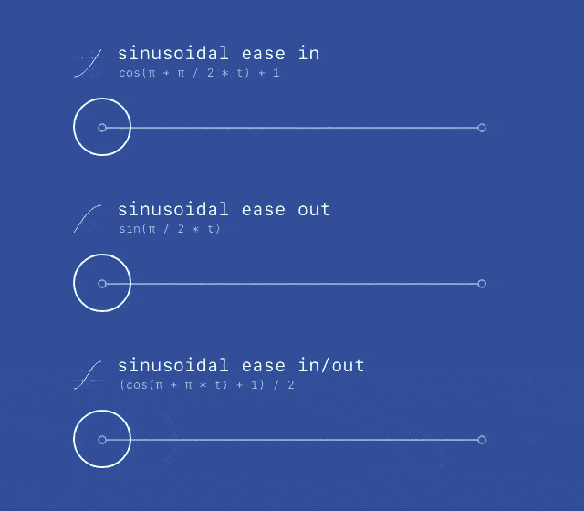

# easing
a comprehensive listing of easing functions (e.g. quadratic, exponential, circular, etc.) to supplement movement in procedural animations.

[view it live][demo]

[][demo]

[demo]: https://semibran.github.io/demo
